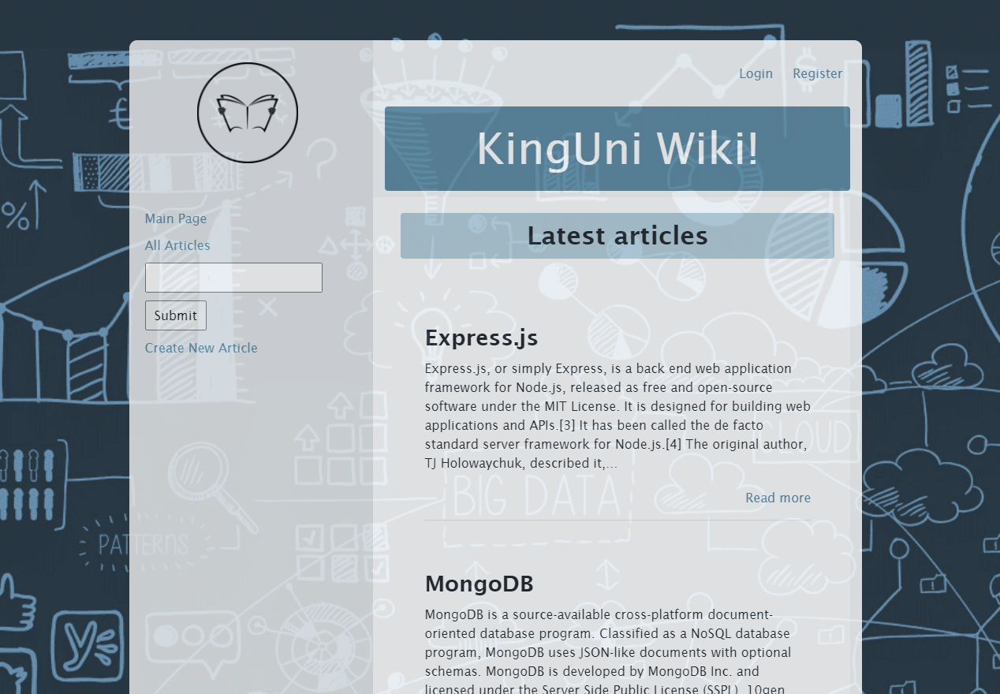

# CodeWiki Single Page (CRUD) Application

<!-- ABOUT THE PROJECT -->

## About The Project

<p align=”center”>

</p>


Implemented a CRUD based Web application (SPA) that stores text baased articles related to coding and programming languages. The application stores users and articles. If you are a guest user, then you are limited to view only access. User features include registration, login, logout, create, read, update and delete. All user authentication is handled on the server-side.


### Built With

- [Javascript](https://www.javascript.com/)
- [Express](https://expressjs.com/)
- [EJS](https://ejs.co/)
- [MongoDB](https://www.mongodb.com/)
- [NodeJS](https://nodejs.dev/)

<!-- GETTING STARTED -->

## Getting Started

### Prerequisites

- npm
  ```sh
  npm install npm@latest -g
  ```

### Installation

1. Clone the repo
   ```sh
   git clone https://github.com/passandscore/wiki-project.git
   ```
2. Install NPM packages
   ```sh
   npm install
   ```
3. Run Dev Server
   ```sh
   npm start
   ```

<!-- CONTRIBUTING -->

## Contributing

Contributions are what make the open source community such an amazing place to be learn, inspire, and create. Any contributions you make are **greatly appreciated**.

1. Fork the Project
2. Create your Feature Branch (`git checkout -b feature/AmazingFeature`)
3. Commit your Changes (`git commit -m 'Add some AmazingFeature'`)
4. Push to the Branch (`git push origin feature/AmazingFeature`)
5. Open a Pull Request


<!-- CONTACT -->

## Contact

Your Name - [Jason Schwarz | LinkedIn](https://www.linkedin.com/in/jason-schwarz-75b91482/)

Project Link: [https://github.com/passandscore/wiki-project](https://github.com/passandscore/wiki-project)
